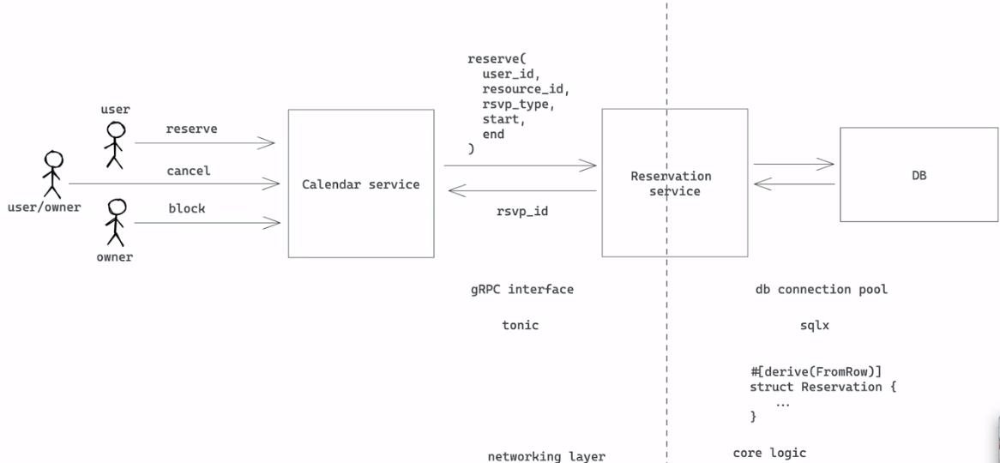

## Feature

- Feature Name: core-reservation
- Start Date: 2023-03-05 23:21:08

## Summary

解决资源预留一段时间的问题，避免预留资源发生冲突

## Motivation

we need a common solution for various reservation requirement: --我们需要一个通用的解决方案来满足各种预订要求：

1. calender booking; --日历预订；
2. hotel/room booking; --酒店/客房预订；
3. meeting room booking; --会议室预订；
4. parking lot booking; --停车场预订；
5. etc. Repeatedly building features for there requirements is a waste of time and resource. We should have a common solution that can be used by all teams; --等等。重复为需求构建功能是浪费时间和资源。 我们应该有一个共同的解决方案所有团队都可以使用

## Guide-level explanation

Basic architecture`构建


## Service Interface

要使用 gRPC 服务， 一些原型定义

```protobuf
enum ReservationStatus {
  UNKNOWN =0;
  PENDING =1;
  CONFIRMED =2; // 确认
  BLOCKED =3;
}

enum ReservationUpdateType {
  UNKNOWN =0;
  CREATE =1;
  UPDATE =2;
  DELETE =3;
}

message Reservation {
  string id = 1;
  string resource_id = 2;
  ReservationType rtype =3 ;

  // resource reservation window`预留资源窗口
  string user_id = 4;
  google.protobuf.Timestamp start = 5;
  google.protobuf.Timestamp end = 6;

  // extra note`额外说明
  string note =7;
}

message ReserveRequest {
  Reservation Reservation =1;
}

message ReserveResponse {
  Reservation Reservation =1;
}

message UpdateRequest {
  string note =1;
}

message UpdateResponse {
  Reservation reservation =1;
}

message ConfirmRequest {
  string id =1;
}

message ConfirmResponse{
  Reservation reservation =1;
}

message CancelRequest {
  string id =1;
}

message CancelResponse{
  Reservation reservation =1;
}

message GetRequest {
  string id =1;
}

message GetResponse{
  Reservation reservation =1;
}

message QueryRequest {
  string resource_id =1;
  string user_id =2;
  // use status to filter result. If UNKNOWN, return all reservations --如果用户状态未知，返回他的所有预定
  ReservationStatus status =3;
  google.protobuf.Timestamp start = 4;
  google.protobuf.Timestamp end = 5;
}

message ListenRequest {}
message ListenResponse {
  Reservation reservation =1;
}

service ReservationService {
  rpc reserve(ReserveRequest) returns (ReserveRequest);
  rpc confirm(ConfirmRequest) returns (ConfirmResponse);
  rpc update(UpdateRequest) returns (UpdateResponse);
  rpc cancel(CancelRequest) returns (CancelResponse);
  rpc get(GetRequest) returns (GetResponse);
  rpc Query(QueryRequest) returns (stream Reservation);
  rpc listen(listenRequest) returns
}
```

## Database schema

We use postgres as the database. Below is the -- 决定使用 postgres 数据库

schema`定义:
```sql
CREATE SCHEMA rsvp;
CREATE TYPE revp.reservation_status AS ENUM("unknown","pending","confirmed","blocked",);
CREATE TYPE revp.reservation_update_type AS ENUM("unknown","create","update","delete");

CREATE TABLE rsvp.reservation {
  id uuid NOT NULL DEFAULT uuid_generate_v4(),
  user_id VARCHAR(64) NOT NULL,
  status rsvp.reservation_status NOT NULL,
  DEFAULT 'pending',

  resource_id VARCHAR(64) NOT NULL,
  timespan TSTZRANGE NOT NULL,

  note TEXT,

  CONSTRAINT raservation_pkey PRIMARY KEY (id),
  CONSTRAINT raservation_conflict EXCLUDE USING gist, (resource_id WITH=, timespan WITH && )
};

CREATE INDEX reservation_resource_id_idx ON revp.reservation (reservation_id);
CREATE INDEX reservation_user_id_idx ON revp.reservation (user_id);

// 如果用户id为空，则查找during中资源的所有预定
// 如果资源id为空，则查找during中用户的所有预定
// 如果两者都为空，则查找during中的所有预定
// 如果两者都设置了，则查during中的所有预定和用户
CREATE OR PEPLACE FUNCTION rsvp.query(uid text, rid text, during: TSTZRANGE)
RETURNS TABLE rsvp.reservation AS $$ $$ LANGUAGE plpgsql;

-- reservation change queue
CREATE TABLE rsvp.reservation_changes(
  id SERIAL NOT NULL,
  resevation_id uuid NOT NULL,
  op rsvp.reservation_update_type NOT NULL,
)

-- tergeer`触发 for add/update/delete a reservation
CREATE OR REPLACE FUNCTION rsvp.reservation_trigger() RETURNS TRIGGER AS $$
BEGIN
  IF TG_OP = 'INSERT' THEN
    INSERT INTO rsvp.reservation_changes(reservation_id, op) VALUE(NEW.id, 'create');
  ELSE TG_OP = 'UPDATE' THEN
    -- 如果OLD.status 不等于 NEW.status，改变 reservation_changes
    IF OLD.status <> NEW.status THEN
      INSERT INTO rsvp.reservation_changes(reservation_id, op)
      VALUE(NEW.id, 'update');
  ELSE TG_OP = 'DELETE' THEN
    INSER INTO rsvp.reservation_changes(reservation, op) VALUES(OLD.id, 'delete');
  END IF;

  NOTIFY reservation_update;
  RETURN NULL;
END;
$$ LANGUAGE plpgsql;

CREATE TRIGGER rsvp.reservation_trigger
  AFTER INSERT OR UPDATE OR DELETE ON rsvp.reservation FOR EACH ROW EXECUTE PROCEDURE rsvp.reservation_trigger();
```

## Reference-level explanation

This is the technical portion of the RFC. Explain the design in sufficient detail that:

- Its interaction with other features is clear.
- It is reasonably clear how the feature would be implemented.
- Corner cases are dissected by example.

The section should return to the examples given in the previous section, and explain more fully how the detailed proposal makes those examples work.

## Drawbacks

Why should we _not_ do this?

## Rationale and alternatives

- Why is this design the best in the space of possible designs?
- What other designs have been considered and what is the rationale for not choosing them?
- What is the impact of not doing this?
- If this is a language proposal, could this be done in a library or macro instead? Does the proposed change make Rust code easier or harder to read, understand, and maintain?

## Prior art

Discuss prior art, both the good and the bad, in relation to this proposal.
A few examples of what this can include are:

- For language, library, cargo, tools, and compiler proposals: Does this feature exist in other programming languages and what experience have their community had?
- For community proposals: Is this done by some other community and what were their experiences with it?
- For other teams: What lessons can we learn from what other communities have done here?
- Papers: Are there any published papers or great posts that discuss this? If you have some relevant papers to refer to, this can serve as a more detailed theoretical background.

This section is intended to encourage you as an author to think about the lessons from other languages, provide readers of your RFC with a fuller picture.
If there is no prior art, that is fine - your ideas are interesting to us whether they are brand new or if it is an adaptation from other languages.

Note that while precedent set by other languages is some motivation, it does not on its own motivate an RFC.
Please also take into consideration that rust sometimes intentionally diverges from common language features.

## Unresolved questions

- What parts of the design do you expect to resolve through the RFC process before this gets merged?
- What parts of the design do you expect to resolve through the implementation of this feature before stabilization?
- What related issues do you consider out of scope for this RFC that could be addressed in the future independently of the solution that comes out of this RFC?

## Future possibilities

Think about what the natural extension and evolution of your proposal would
be and how it would affect the language and project as a whole in a holistic
way. Try to use this section as a tool to more fully consider all possible
interactions with the project and language in your proposal.
Also consider how this all fits into the roadmap for the project
and of the relevant sub-team.

This is also a good place to "dump ideas", if they are out of scope for the
RFC you are writing but otherwise related.

If you have tried and cannot think of any future possibilities,
you may simply state that you cannot think of anything.

Note that having something written down in the future-possibilities section
is not a reason to accept the current or a future RFC; such notes should be
in the section on motivation or rationale in this or subsequent RFCs.
The section merely provides additional information.
